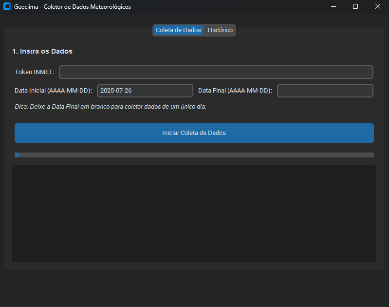

# 🚀 Geoclima - Coletor de Dados Meteorológicos

Uma aplicação de desktop que automatiza a coleta de dados diários de estações meteorológicas do INMET, processa as informações e as salva em arquivos CSV (.csv) limpos e organizados.

</img>

---

## ✅ Funcionalidades Principais

- **Interface Gráfica Intuitiva**: Fácil de usar, com campos para token, datas e feedback em tempo real.
- **Busca por Data ou Intervalo**: Colete dados de um único dia ou de um período específico.
- **Coleta em Massa**: Consulta dezenas de estações de uma só vez, de forma automatizada.
- **Exportação para CSV**: Gera um arquivo `.csv` para cada dia consultado, com colunas selecionadas e cabeçalhos renomeados para fácil leitura.
- **Feedback em Tempo Real**: Acompanhe o progresso com uma barra de status e um log detalhado.
- **Histórico de Arquivos**: Acesse e abra facilmente os arquivos gerados diretamente pela aplicação.
- **Design Resiliente**: Se a consulta a uma estação falhar, o script registra o erro e continua com as próximas.

---

## ⚙️ Primeiros Passos: Instalação e Configuração

Siga os passos abaixo para deixar o ambiente pronto para execução.

### 1. Pré-requisitos

- **Python**: Versão 3.9 ou superior.
- **Poetry**: Um gerenciador de dependências para Python. Siga as instruções de instalação oficiais.
- **Token da API do INMET**: Um token de acesso é necessário para fazer as consultas. Você pode obter o seu gratuitamente no Portal do Desenvolvedor do INMET.

### 2. Instalação do Projeto

1.  **Clone o Repositório**
    Clone ou baixe os arquivos deste projeto para o seu computador.

    ```bash
    git clone https://github.com/PaulitoRenatito/GeoclimaProject.git
    cd GeoclimaProject
    ```

2.  **Instale as Dependências com Poetry** O Poetry lerá o arquivo `pyproject.toml`, criará um ambiente virtual e instalará todas as bibliotecas necessárias.
    ```bash
    poetry install
    ```

---

## ▶️ Como Executar

Com tudo instalado, execute a aplicação com o seguinte comando do Poetry, que garante que o script rode no ambiente virtual correto:

```bash
poetry run python gui.py
```

### Usando a Aplicação
1. **Cole seu Token**: No campo "Token INMET", cole o código de acesso que você obteve.
2. **Escolha as Datas**:
   - Para um único dia, preencha apenas a "Data Inicial".
   - Para um período, preencha a "Data Inicial" e a "Data Final".
3. **Inicie a Coleta**: Clique no botão "Iniciar Coleta de Dados".

A barra de progresso e a caixa de log mostrarão o andamento. Ao final, os arquivos gerados aparecerão na aba "Histórico" e serão salvos na pasta `output/`.